<div align="center">

# JCC S18 Research Lab

**A deterministic lineup discovery, simulation, and live decision system for Golden Spatula S18**

**金铲铲之战「怪兽入侵」阵容发现、数值实验与对局决策研究系统**

[](data/chess.js)
[](artifacts/results/route_certification_results.json)
[](docs/reports/虚拟实战数字孪生.md)
[](https://github.com/2300969-star/jcc-s18-research-lab/actions)
[](LICENSE)

[Research Dashboard](public/index.html) · [Match Mode](public/match.html) · [Methodology](docs/reports/版本路线认证实验.md) · [中文文档](#快速开始)

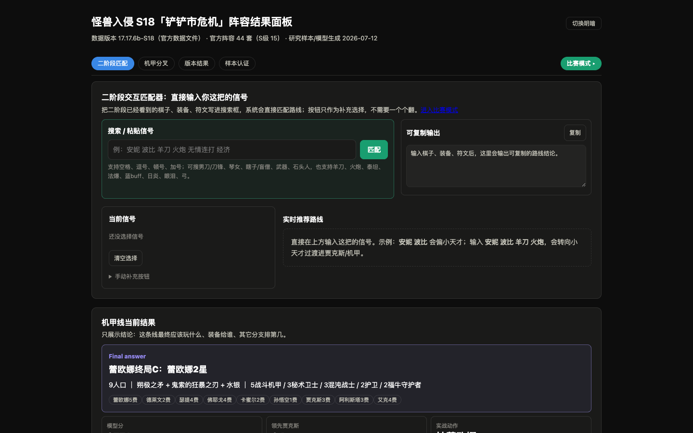

</div>

## What This Project Does

Official recommended lineups are treated as **baselines, not answers**. The project reconstructs the current S18 environment from local game data and applies deterministic models to answer four questions:

- Which units, items, traits, and augments form nonlinear value loops?
- Which lineups remain strong under shop, economy, item, opponent, and transition uncertainty?
- What should be played from the assets actually held at levels 1-9?
- Which recommendation failures should become permanent regression fixtures?

The browser application contains two working surfaces:

| Surface | Purpose |
|---|---|
| **Research Dashboard** | Version results, generated lineups, certified conditional routes, stage transitions, numerical audits, and experiment reports |
| **Match Mode** | Fast Chinese signal parsing, persistent round/gold state, route-continuity management, honest augment comparison, hero-augment pruning, concrete actions, and optional LLM fallback |

<details>
<summary><strong>Match Mode preview / 比赛模式预览</strong></summary>
<br>
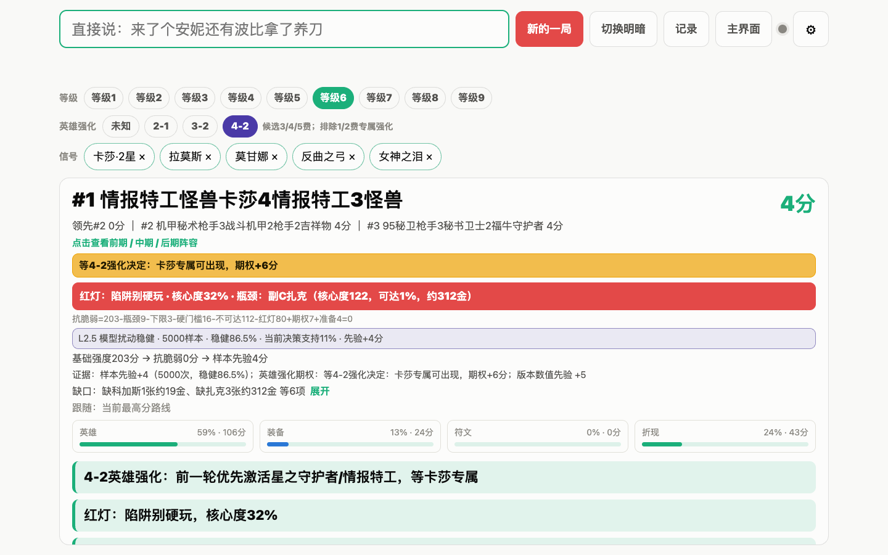
</details>

## Research Stack

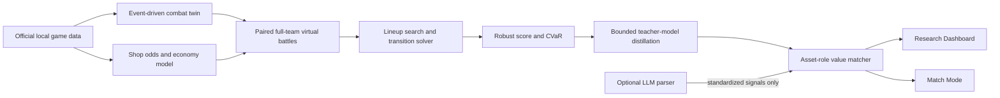

The LLM is deliberately outside the ranking loop. It may translate unrecognized Chinese speech into a closed vocabulary, but all lineup scoring, shop probability, equipment inference, augment operators, and recommendations remain deterministic.

## Match Mode / 比赛模式

比赛模式面向快速连续录入，而不是要求每次填写一张完整局面表。棋子、星级、装备、羁绊和符文可直接用自然中文输入；当前等级、强化回合、对局回合和金币档位也可通过页面快捷按钮维护。

```text
来了个安妮还有波比，拿了羊刀
现在3-2，有35金币
来了高端，来了光明神器，来了升级吧，选哪个
```

当前版本的关键行为：

- 中文输入只在按回车或点击“录入”后提交，输入法组合阶段不会提前入池。
- “新的一局”会取消仍在处理的 LLM 请求，并清空本局信号、回合和金币，避免异步串局。
- 纠错支持“不是安妮是波比”“把羊刀改成轻语”“撤销上一个”等表达。
- 路线排名考虑已持有资产、星级、装备继承、商店概率、抗脆弱性和转阵成本；小分差不会频繁切换执行路线。
- 当前回合使用 `2-1 / 3-2 / 4-2` 快捷选择；金币只需选择 `0-9` 到 `50+` 的档位，不要求精确维护当前经验。
- 符文三选一在点击前只是候选，不会提前写入正式信号池。

### 符文三选一的可信边界

三选一页面不会再把阵容总分、静态虚拟胜率或路线覆盖数冒充为符文评分。系统只在局面信息和专属反事实模型均充分、且领先差超过阈值时才允许标记最佳项。当前专属反事实模型尚未完成，因此页面会：

- 展示已核验的符文机制和适用条件；
- 明确提示仍缺少的金币、回合、棋盘或装备信息；
- 将“命中多少条路线偏好”标为覆盖统计，不参与排序；
- 信息不足或证据未经验证时不默认标绿第一张，也不强行给出首推。

机制取值、来源等级、已确认项和未知项见 [怪兽入侵机制知识审计](docs/reports/怪兽入侵机制知识审计.md)。规则集快照位于 [`data/ruleset/monster-invasion-17.6b.json`](data/ruleset/monster-invasion-17.6b.json)。

## Research Figures / 研究图谱

These figures are generated from the repository's deterministic outputs rather than drawn as presentation-only mockups. Run `npm run figures` after rebuilding the model to refresh every number shown below.

### Formula calculations / 公式计算

<p align="center">
  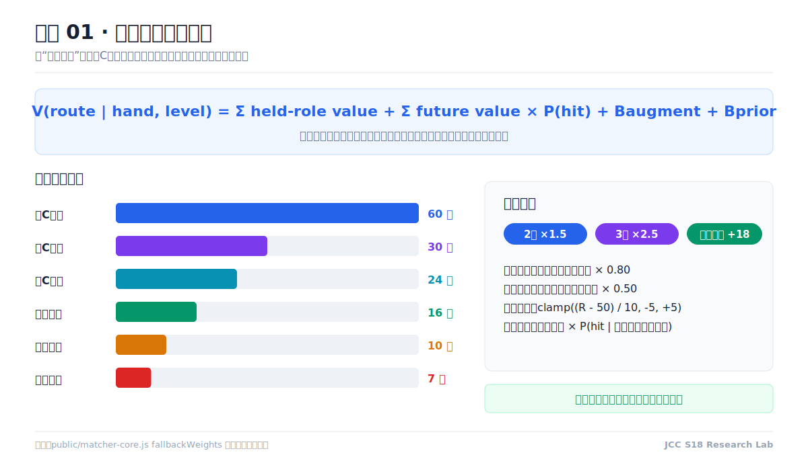
  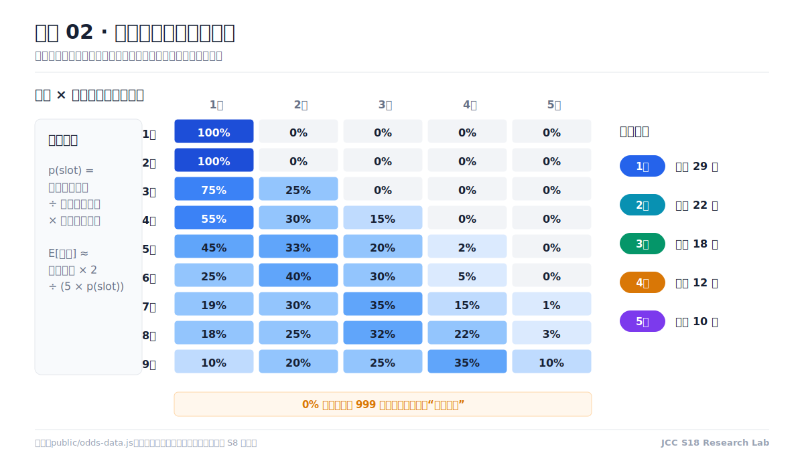
</p>

The first graph exposes the role coefficients used by Match Mode. The second graph maps the complete level 1-9 shop matrix and explains how an unavailable high-cost unit becomes a zero-value late target instead of a fake `999`-gold estimate.

<p align="center">
  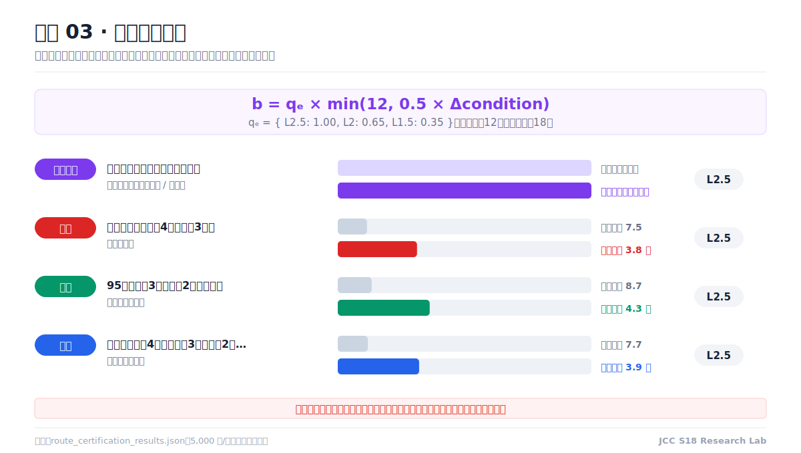
</p>

The augment graph separates hard hero-mechanism gates from soft combat, economy, and item operators. Soft bonuses must survive both the condition-lift cap and the evidence-level discount before entering a recommendation.

### Lineup derivation / 阵容推导

<p align="center">
  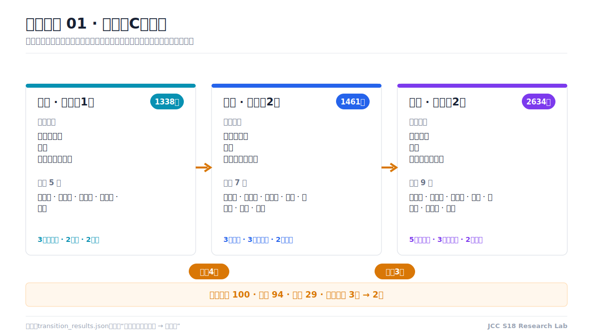
  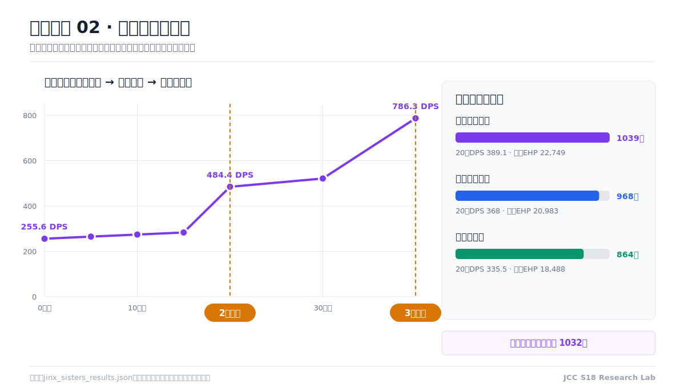
</p>

- **Mecha transition:** jointly optimizes stage strength, retained units, and item inheritance instead of scoring only the final board.
- **Jinx sisters:** independently validates the AP stacking curve, missile breakpoints, and three candidate end-board shells.

<p align="center">
  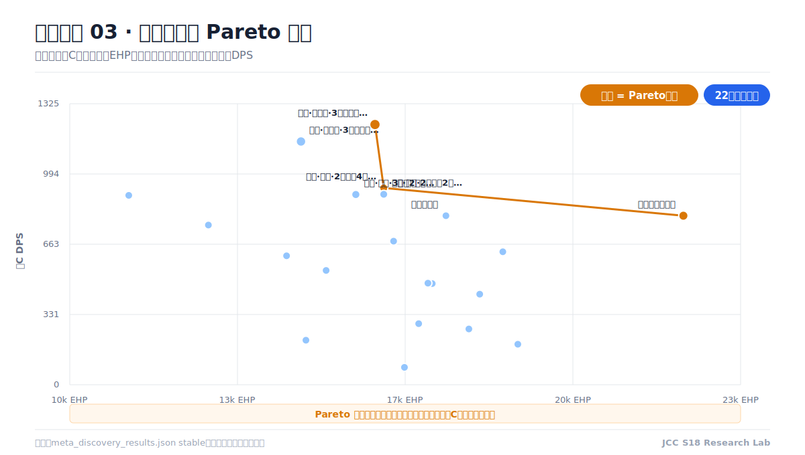
</p>

The solver frontier shows why the highest carry DPS is not automatically the best lineup. Orange points are non-dominated boards for carry output and frontline EHP; bubble size adds full-team value.

### Model verification / 模型验算

<p align="center">
  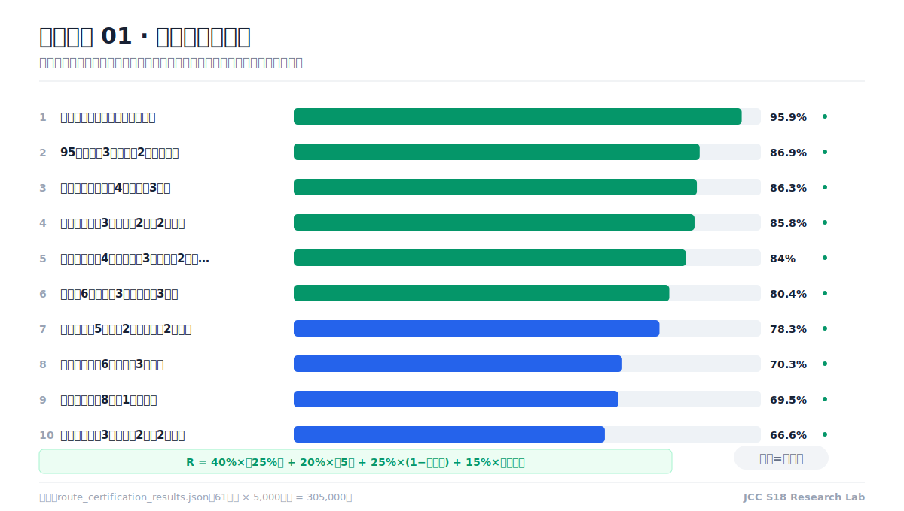
  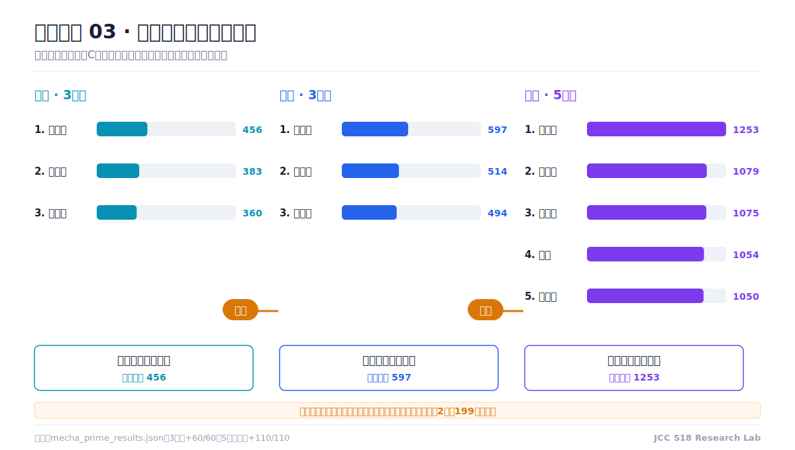
</p>

The certification chart summarizes the current top ten under shared uncertainty samples. The Prime experiment fixes the board and items, changes only the Prime holder, and reruns the combat model to isolate causal impact.

<p align="center">
  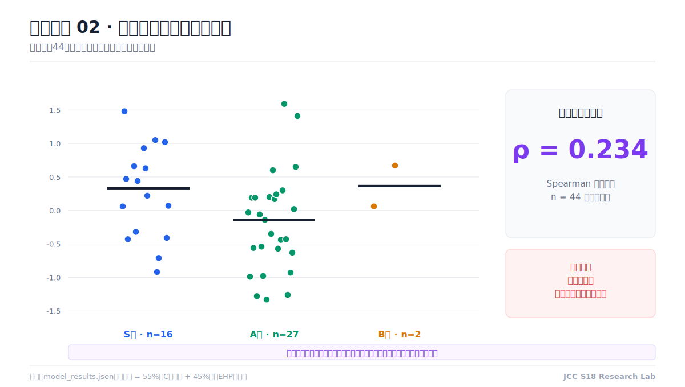
</p>

The validation boundary is intentionally visible: the current official-tier correlation is only `Spearman ρ = 0.244` across 44 lineups. The system therefore reports model evidence, not a claim that its ranking is already ground truth.

## Model Highlights

### Asset-role value model

Each held signal is valued by its role in a route rather than by flat checklist overlap:

```text
route score = held role value + probability-discounted future value
            + augment operators + bounded virtual-battle prior
```

- Main carry body and star level receive the highest unit value.
- Completed items are valued by holder role; components are paired without double counting.
- Missing units are discounted by level-specific shop odds and expected reroll gold.
- Explicit trait counts are matched against activated end-board traits.
- A fragile route can be downgraded when one low-probability component dominates the plan.

### Conditional augment operators

The condition lift is discounted by evidence level before entering Match Mode:

```text
b = q_e × min(12, 0.5 × (conditional fitness - baseline robustness))
q_e = { L2.5: 1.00, L2: 0.65, L1.5: 0.35 }
```

- **Combat augments** scale with current board readiness.
- **Economy augments** alter effective shop level, reroll cost, or copy requirements.
- **Item augments** compensate missing carry items and decay after the build is complete.
- **Hero augments** remain hard mechanism gates with explicit required units.

### Digital-twin boundary

The event engine currently evaluates all **60 routes in 1,770 pairings and 21,240 side-swapped battles**. Every pairing reuses the same random seed after swapping sides, then reports win rate, health margin, lower-tail CVaR, and mechanism coverage. Unsupported mechanics shrink the Match Mode prior toward zero instead of being silently treated as verified.

The result is a **model-internal dominance claim**, not an observed ladder win rate. Public guides may seed candidate generation, but they do not calibrate ranking weights. The fast Match Mode model receives at most a bounded `±12` point prior from the event simulator:

```text
virtual prior = 12 × tanh((robust score - 50) / 18) × mechanism coverage
```

## 快速开始

### 1. Clone and test

```bash
git clone https://github.com/2300969-star/jcc-s18-research-lab.git
cd jcc-s18-research-lab
npm test
```

No runtime package installation is required. The project uses Node.js built-ins and a static frontend.

### 2. Start the dashboard

```bash
npm run serve
```

Open:

- Dashboard: `http://127.0.0.1:8766/public/index.html`
- Match Mode: `http://127.0.0.1:8766/public/match.html`
- Audit View: `http://127.0.0.1:8766/public/audit/index.html`

### 3. Optional LLM fallback

```bash
npm run proxy
```

In Match Mode settings, use `http://127.0.0.1:8787/v1` and provide your own OpenAI-compatible API key. The key remains in browser `localStorage`; the proxy forwards it without persisting it.

The local vocabulary parser always runs first. Without a key or network, the entire ranking system remains usable.

## Reproduce The Research

```bash
npm run build:model        # combat model, item search, full-team search
npm run build:discovery    # lineup discovery, transitions, numeric lens
npm run build:experiments  # Jinx sisters and Mecha experiments
npm run build:matcher      # stage matcher and route certification
npm run build:virtual      # 21,240 paired full-team event battles
npm run research:community # audit public guides/videos as evidence, not ground truth
npm run audit              # data, skill, item, and outlier audits
npm run figures            # regenerate README research figures
```

Run the complete deterministic pipeline:

```bash
npm run build
```

Refresh upstream game data and regenerate all outputs:

```bash
npm run update:data
```

## Repository Layout

```text
.
├── src/
│   ├── core/          # combat model, version context, mechanism profiles
│   ├── sim/           # event-driven full-team combat twin
│   ├── pipeline/      # discovery, transition, matcher, certification
│   ├── experiments/   # focused counterfactual laboratories
│   ├── audit/         # numerical and data-quality audits
│   └── lib/           # shared project paths
├── public/            # static dashboard, match mode, browser data, assets
├── data/              # upstream game data snapshots
├── artifacts/results/ # deterministic JSON outputs
├── docs/
│   ├── reports/       # generated and curated research reports
│   ├── notes/         # extracted lineup details
│   └── images/        # repository screenshots
├── tests/fixtures/    # permanent regression hands
├── tools/             # optional local services
└── scripts/           # data refresh and maintenance entrypoints
```

## Selected Reports

- [版本路线认证实验](docs/reports/版本路线认证实验.md)
- [虚拟实战数字孪生](docs/reports/虚拟实战数字孪生.md)
- [社区公开样本证据审计](docs/reports/社区公开样本证据审计.md)
- [元阵容自动求解](docs/reports/元阵容自动求解.md)
- [阵容发现研究](docs/reports/阵容发现研究.md)
- [姐妹无限金克丝实验](docs/reports/姐妹无限金克丝实验.md)
- [机甲分叉实验](docs/reports/机甲分叉实验.md)
- [至尊机甲实验](docs/reports/至尊机甲实验.md)
- [数值与 Bug 审计](docs/reports/数值与Bug审计.md)

## Regression Philosophy

When a real game disproves a recommendation, the preferred response is not an isolated score patch. Add the hand to [`tests/fixtures/hands.json`](tests/fixtures/hands.json), identify which assumption failed, and make the deterministic model pass both the new fixture and the existing suite.

## Scope And Disclaimer

This repository is independent, non-commercial community research. It is not an official product and does not guarantee placement or win rate. Game data, names, trademarks, icons, and artwork belong to their respective owners and are not covered by the MIT code license. See [NOTICE.md](NOTICE.md).

## Contributing

Issues and pull requests are welcome when they include reproducible evidence. Read [CONTRIBUTING.md](CONTRIBUTING.md), [SECURITY.md](SECURITY.md), and the [Code of Conduct](CODE_OF_CONDUCT.md) before contributing.
