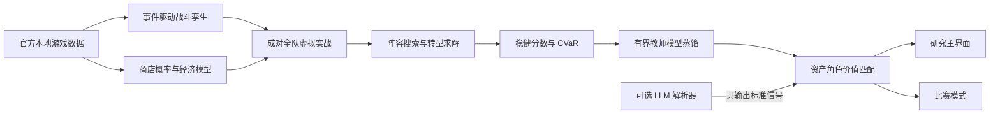

<div align="center">

# 金铲铲怪兽入侵 · S18 研究工程

**阵容发现、数值实验、虚拟实战与对局决策系统**

Golden Spatula S18 deterministic research lab

[](资源/游戏数据/chess.js)
[](生成产物/结果/route_certification_results.json)
[](文档/研究报告/虚拟实战数字孪生.md)
[](https://github.com/2300969-star/jcc-s18-research-lab/actions)
[](LICENSE)

[快速开始](#快速开始) · [功能概览](#功能概览) · [比赛模式](#比赛模式) · [星神玩法](#星神玩法) · [研究图谱](#研究图谱) · [项目结构](#项目目录结构) · [研究报告](#研究报告)


</div>

> 本仓库是可在本机运行的研究工程，不是在线网页。Clone 后运行 `npm run serve`，或在 macOS 双击根目录的 `启动前端.command`。

## 功能概览

项目把官方推荐阵容当作**基线而不是答案**，从本地游戏数据重建当前 S18 环境，并用确定性模型回答四类问题：

- 哪些棋子、装备、羁绊和强化能形成非线性价值闭环？
- 哪些阵容在商店、经济、装备、对手和转型不确定性下仍然稳健？
- 1 至 9 级时，如何根据实际持有资产选择当前路线？
- 哪些真实对局中的错误建议应沉淀为永久回归样本？

浏览器端提供四个可直接使用的界面：

| 界面 | 用途 | 本地入口 |
|---|---|---|
| **研究主界面** | 版本结果、生成阵容、路线认证、阶段转型、数值审计与实验报告 | [`应用/前端/index.html`](应用/前端/index.html) |
| **比赛模式** | 中文信号录入、局面状态、路线连续性、符文比较、行动建议与赛后复盘 | [`应用/前端/match.html`](应用/前端/match.html) |
| **星神比赛模式** | 当前资产、赐福、实时路线排序与换线判断 | [`应用/前端/star-god-match.html`](应用/前端/star-god-match.html) |
| **星神实验室** | 九神状态机、赐福价值拆解与虚拟敏感性研究 | [`应用/前端/star-god.html`](应用/前端/star-god.html) |

<details>
<summary><strong>Match Mode preview / 比赛模式预览</strong></summary>
<br>

</details>

## 研究架构


```mermaid
flowchart LR
  A["官方本地游戏数据"] --> B["事件驱动战斗孪生"]
  A --> C["商店概率与经济模型"]
  B --> D["成对全队虚拟实战"]
  C --> D
  D --> E["阵容搜索与转型求解"]
  E --> F["稳健分数与 CVaR"]
  F --> G["有界教师模型蒸馏"]
  G --> K["资产角色价值匹配"]
  K --> H["研究主界面"]
  K --> I["比赛模式"]
  J["可选 LLM 解析器"] -->|"只输出标准信号"| K
```

LLM 被明确放在排序闭环之外，只能把本地解析器未识别的中文表达翻译成封闭词表。阵容评分、商店概率、装备推断、强化算子和最终建议仍由确定性模型完成。

## 星神玩法

星神玩法使用独立的 `setId=17` 数据层，不与怪兽入侵的英雄、装备或比赛状态混用。构建脚本从腾讯官方资料规范化9位星神、110个唯一赐福、63个可玩英雄、34个羁绊、262件装备、277个强化、20个开场奇遇和44套前中后期阵容。

模型把每个赐福拆成即时战力、经济、灵活性、延迟兑现、尾部风险和不可逆承诺，并对九位星神使用不同状态变量：索尔任务进度、亚索永久格、凯尔装备方向、阿狸共选人数、韦鲁斯费用结构、艾克生存折现、锤石随机尾部、索拉卡生命边际价值和伊芙琳卖血代价。

星神比赛模式把44套官方前中后期阵容作为种子，不当作答案。构建期另外生成单槽反事实改良与束搜索候选；实时排序只读取当前棋子、星级、装备、已选赐福、等级和经济。同一最终状态必然得到同一结论，1至3级只给过渡，不锁终局。由于当前缺少星神模式独立牌库概率证据，界面中的缺口金额只按卡牌面值计算。

```bash
npm run build:star-god
```

比赛入口为 [`应用/前端/star-god-match.html`](应用/前端/star-god-match.html)，赐福实验入口为 [`应用/前端/star-god.html`](应用/前端/star-god.html)。研究报告见 [`文档/研究报告/星神阵容生成与比赛模式研究.md`](文档/研究报告/星神阵容生成与比赛模式研究.md) 与 [`文档/研究报告/星神玩法17.7研究.md`](文档/研究报告/星神玩法17.7研究.md)。羽饰骑士生命分档、普通4-7神之秘宝包池和当前牌库份数没有可靠证据，页面明确标为未自证，不用猜测值填补。


## 比赛模式

比赛模式面向快速连续录入，而不是要求每次填写一张完整局面表。棋子、星级、装备、羁绊和符文可直接用自然中文输入；当前等级、强化回合、对局回合和金币档位也可通过页面快捷按钮维护。

```text
来了个安妮还有波比，拿了羊刀
现在3-2，有35金币
来了高端，来了光明神器，来了升级吧，选哪个
```

当前版本的关键行为：

- 中文输入只在按回车或点击“录入”后提交，输入法组合阶段不会提前入池。
- “结束本局”保存或放弃复盘并开新局时，会取消仍在处理的 LLM 请求并清空本局状态，避免异步串局。
- 纠错支持“不是安妮是波比”“把羊刀改成轻语”“撤销上一个”等表达。
- 路线排名考虑已持有资产、星级、装备继承、商店概率、抗脆弱性和转阵成本；小分差不会频繁切换执行路线。
- 当前回合使用 `2-1 / 3-2 / 4-2` 快捷选择；金币只需选择 `0-9` 到 `50+` 的档位，不要求精确维护当前经验。
- 符文三选一在点击前只是候选，不会提前写入正式信号池。
- 棋子、装备、回合、经济和执行路线变化会形成比赛模式回放快照；“结束本局”补录名次、执行程度与明确判断后，才进入复盘样本。
- 复盘以30局可用样本作为探索校准门槛、100局作为划分独立留出集门槛；合成回归不计数，名次不会自动解释为模型对错。

### 符文三选一的可信边界

三选一页面不会再把阵容总分、静态虚拟胜率或路线覆盖数冒充为符文评分。系统只在局面信息和专属反事实模型均充分、且领先差超过阈值时才允许标记最佳项。当前专属反事实模型尚未完成，因此页面会：

- 展示已核验的符文机制和适用条件；
- 明确提示仍缺少的金币、回合、棋盘或装备信息；
- 将“命中多少条路线偏好”标为覆盖统计，不参与排序；
- 信息不足或证据未经验证时不默认标绿第一张，也不强行给出首推。

机制取值、来源等级、已确认项和未知项见 [怪兽入侵机制知识审计](文档/研究报告/怪兽入侵机制知识审计.md)。规则集快照位于 [`资源/游戏数据/ruleset/monster-invasion-17.7.json`](资源/游戏数据/ruleset/monster-invasion-17.7.json)，本次更新的数值差分与重算结论见 [17.7 版本更新重算](文档/研究报告/17.7版本更新重算.md)。

## 研究图谱

以下图表直接从仓库中的确定性结果生成，不是只用于展示的示意图。模型重建后运行 `npm run figures`，即可刷新图中的全部数字。

### 公式计算

<p align="center">
  
  
</p>

第一张图展示比赛模式使用的角色系数；第二张图覆盖 1 至 9 级完整商店矩阵，并说明当前等级无法出现的高费棋子为何应作为零价值远期目标，而不是伪造 `999` 金币估值。

<p align="center">
  
</p>

强化图把英雄机制硬门槛与战斗、经济、装备软算子分开。软加成必须同时经过条件增益上限和证据等级折扣，才能进入建议。

### 阵容推导

<p align="center">
  
  
</p>

- **机甲转型：** 联合优化阶段战力、保留棋子和装备继承，而不是只给最终棋盘打分。
- **姐妹金克丝：** 独立验证法强叠加曲线、导弹断点和三套候选终局外壳。

<p align="center">
  
</p>

求解前沿解释了主 C 输出最高为何不等于阵容最优。橙色点是在主 C 输出与前排有效生命维度上不被支配的棋盘，气泡大小进一步表示全队价值。

### 模型验算

<p align="center">
  
  
</p>

认证图汇总共享不确定性样本下的当前前十路线。至尊机甲实验固定棋盘和装备，只改变机甲选择者并重跑战斗模型，以隔离因果影响。

<p align="center">
  
</p>

验证边界会被明确展示：当前 45 套阵容与官方等级的相关性仅为 `Spearman ρ = 0.234`。因此系统报告的是模型证据，不宣称排序已经等同于真实环境结论。

## 模型重点

### 资产角色价值模型

每个已持有信号按其在路线中的角色估值，而不是简单计算清单重合度：

```text
route score = held role value + probability-discounted future value
            + augment operators + bounded virtual-battle prior
```

- 主 C 本体和星级获得最高棋子价值。
- 成装按持有者角色估值；散件配对时不重复计数。
- 缺失棋子按当前等级商店概率和期望刷新金币折扣。
- 已明确的羁绊数量与终局激活羁绊匹配。
- 当一个低概率组件主导整套计划时，脆弱路线会被降级。

### 条件强化算子

条件增益在进入比赛模式前按证据等级折扣：

```text
b = q_e × min(12, 0.5 × (conditional fitness - baseline robustness))
q_e = { L2.5: 1.00, L2: 0.65, L1.5: 0.35 }
```

- **战斗强化**随当前棋盘完成度缩放。
- **经济强化**改变有效商店等级、刷新成本或追星副本需求。
- **装备强化**补偿主 C 缺失装备，并在装备成型后衰减。
- **英雄强化**保留为带明确棋子要求的机制硬门槛。

### 数字孪生边界

事件引擎目前评估全部 **67 条路线、2,211 组对局和 26,532 场换边战斗**。每组对局换边后复用相同随机种子，再报告胜率、剩余生命差、下尾 CVaR 与机制覆盖率。未支持机制会让比赛模式先验向零收缩，不会被静默当成已验证。当前可执行英雄强化目录覆盖 **122 项中的 53 项**，其余机制保持折扣，不填入猜测值。

结果表达的是**模型内部优势**，不是实测排位胜率。公开攻略可以用于生成候选，但不能校准排序权重。快速比赛模型从事件模拟器获得的先验最多限制在 `±12` 分：

```text
virtual prior = 12 × tanh((robust score - 50) / 18) × mechanism coverage
```

## 快速开始

### 1. 克隆并检查

```bash
git clone https://github.com/2300969-star/jcc-s18-research-lab.git
cd jcc-s18-research-lab
npm test
```

需要 Node.js 18 或更高版本。项目只使用 Node.js 内置模块和静态前端，无需执行 `npm install`。

### 2. macOS 一键启动

在 Finder 中双击项目根目录的 [`启动前端.command`](启动前端.command)。启动器会自动识别自身所在的项目目录，启动本地前端与可选 LLM 代理，并用浏览器打开研究主界面。

也可以在终端执行：

```bash
open 启动前端.command
```

### 3. 手动启动前端

```bash
npm run serve
```

浏览器入口：

- 研究主界面：`http://127.0.0.1:8766/应用/前端/index.html`
- 比赛模式：`http://127.0.0.1:8766/应用/前端/match.html`
- 星神比赛模式：`http://127.0.0.1:8766/应用/前端/star-god-match.html`
- 审计界面：`http://127.0.0.1:8766/应用/前端/audit/index.html`

### 4. 可选 LLM 慢车道

```bash
npm run proxy
```

在比赛模式设置中填写 `http://127.0.0.1:8787/v1`，并使用自己的 OpenAI 兼容 API Key。Key 仅保留在浏览器 `localStorage` 中，本地代理只负责转发，不持久化保存。

本地封闭词表解析器始终优先运行；没有 Key 或网络时，完整确定性排序系统仍然可用。

## 复现实验

```bash
npm run build:model        # combat model, item search, full-team search
npm run build:discovery    # lineup discovery, transitions, numeric lens
npm run build:experiments  # Jinx sisters and Mecha experiments
npm run build:matcher      # stage matcher and route certification
npm run build:virtual      # 26,532 paired full-team event battles
npm run build:event-model  # coverage delta, operator audit, and route evidence
npm run research:community # audit public guides/videos as evidence, not ground truth
npm run audit              # data, skill, item, and outlier audits
npm run figures            # regenerate README research figures
```

运行完整确定性流水线：

```bash
npm run build
```

刷新上游游戏数据并重建全部产物：

```bash
npm run update:data
```

## 项目目录结构

```text
.
├── 启动前端.command          # macOS 一键启动入口
├── 应用/
│   └── 前端/                 # 静态主界面、比赛模式、浏览器数据和素材
├── 工程/
│   ├── 源码/
│   │   ├── core/             # 核心模型与版本上下文
│   │   ├── sim/              # 事件驱动战斗模拟
│   │   ├── pipeline/         # 搜索、转型、匹配和认证流程
│   │   ├── experiments/      # 专项反事实实验
│   │   ├── audit/            # 数值与数据质量审计
│   │   └── lib/              # 统一项目路径
│   ├── 测试/
│   │   └── 样本/             # 永久回归局面
│   ├── 工具/                 # 本地代理和图表生成器
│   └── 脚本/                 # 数据更新与维护入口
├── 资源/
│   └── 游戏数据/             # 腾讯游戏资料与版本化规则快照
├── 文档/
│   ├── 研究报告/             # 生成与人工维护的研究结论
│   ├── 阵容资料/             # 官方阵容明细
│   └── 图片/                 # README 图表和界面截图
└── 生成产物/
    ├── 结果/                 # 确定性 JSON 计算结果
    └── 截图/                 # 浏览器验收截图
```

详细职责、修改边界和常用入口见 [项目结构说明](文档/项目结构说明.md)。源码内部保留 `core/pipeline/experiments` 等通用模块名，便于 Node.js、CI 和公开仓库工具识别。

## 研究报告

- [版本路线认证实验](文档/研究报告/版本路线认证实验.md)
- [虚拟实战数字孪生](文档/研究报告/虚拟实战数字孪生.md)
- [社区公开样本证据审计](文档/研究报告/社区公开样本证据审计.md)
- [元阵容自动求解](文档/研究报告/元阵容自动求解.md)
- [阵容发现研究](文档/研究报告/阵容发现研究.md)
- [姐妹无限金克丝实验](文档/研究报告/姐妹无限金克丝实验.md)
- [机甲分叉实验](文档/研究报告/机甲分叉实验.md)
- [至尊机甲实验](文档/研究报告/至尊机甲实验.md)
- [数值与 Bug 审计](文档/研究报告/数值与Bug审计.md)
- [17.7 版本更新重算](文档/研究报告/17.7版本更新重算.md)

## 回归原则

当真实对局推翻某条建议时，不应只做孤立的分数补丁。应把局面加入 [`工程/测试/样本/hands.json`](工程/测试/样本/hands.json)，定位失效假设，并让确定性模型同时通过新样本与既有测试套件。

## 范围与声明

本仓库是独立、非商业的社区研究项目，并非官方产品，不保证名次或胜率。游戏数据、名称、商标、图标和美术素材归各自权利人所有，不包含在 MIT 代码许可证内，详见 [NOTICE.md](NOTICE.md)。

## 参与贡献

欢迎提交包含可复现证据的 Issue 与 Pull Request。参与前请阅读 [CONTRIBUTING.md](CONTRIBUTING.md)、[SECURITY.md](SECURITY.md) 和 [行为准则](CODE_OF_CONDUCT.md)。
