<div align="center">

# JCC S18 Research Lab

**A deterministic lineup discovery, simulation, and live decision system for Golden Spatula S18**

**金铲铲之战「怪兽入侵」阵容发现、数值实验与对局决策研究系统**

[](资源/游戏数据/chess.js)
[](生成产物/结果/route_certification_results.json)
[](文档/研究报告/虚拟实战数字孪生.md)
[](https://github.com/2300969-star/jcc-s18-research-lab/actions)
[](LICENSE)

[Research Dashboard](应用/前端/index.html) · [Match Mode](应用/前端/match.html) · [Star God Match](应用/前端/star-god-match.html) · [Star God Lab](应用/前端/star-god.html) · [Methodology](文档/研究报告/版本路线认证实验.md) · [Event Model](文档/研究报告/统一事件模型实验.md) · [中文文档](#快速开始)

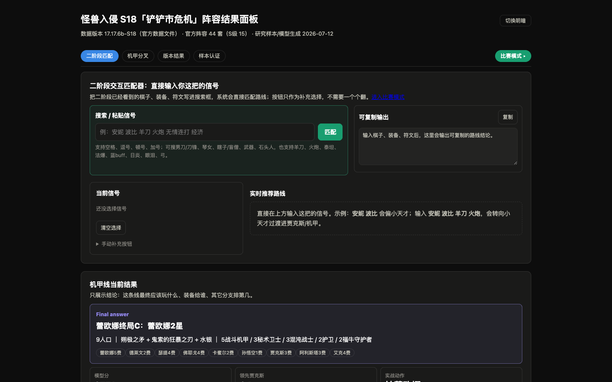

</div>

## What This Project Does

Official recommended lineups are treated as **baselines, not answers**. The project reconstructs the current S18 environment from local game data and applies deterministic models to answer four questions:

- Which units, items, traits, and augments form nonlinear value loops?
- Which lineups remain strong under shop, economy, item, opponent, and transition uncertainty?
- What should be played from the assets actually held at levels 1-9?
- Which recommendation failures should become permanent regression fixtures?

The browser application contains three working surfaces:

| Surface | Purpose |
|---|---|
| **Research Dashboard** | Version results, generated lineups, certified conditional routes, stage transitions, numerical audits, and experiment reports |
| **Match Mode** | Fast Chinese signal parsing, persistent round/gold state, route-continuity management, honest augment comparison, hero-augment pruning, concrete actions, and optional LLM fallback |
| **Star God Lab** | Independent 17.7 ruleset, nine-god state machine, blessing value decomposition, main-god history, and 5,400-state virtual sensitivity study |

<details>
<summary><strong>Match Mode preview / 比赛模式预览</strong></summary>
<br>
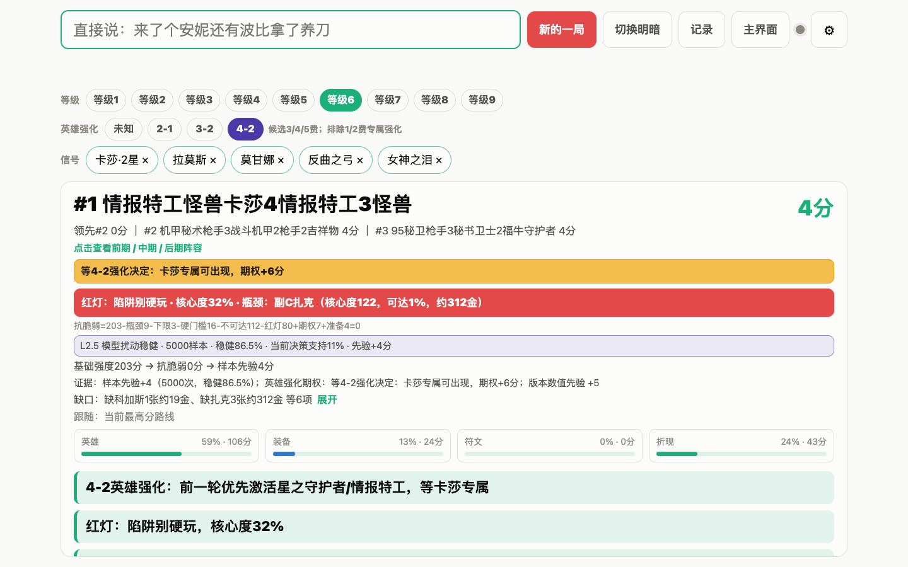
</details>

## Research Stack

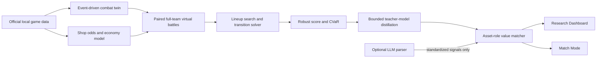
```mermaid
flowchart LR
  A[Official local game data] --> B[Event-driven combat twin]
  A --> C[Shop odds and economy model]
  B --> D[Paired full-team virtual battles]
  C --> D
  D --> E[Lineup search and transition solver]
  E --> F[Robust score and CVaR]
  F --> G[Bounded teacher-model distillation]
  G --> K[Asset-role value matcher]
  K --> H[Research Dashboard]
  K --> I[Match Mode]
  J[Optional LLM parser] -->|standardized signals only| K
```

The LLM is deliberately outside the ranking loop. It may translate unrecognized Chinese speech into a closed vocabulary, but all lineup scoring, shop probability, equipment inference, augment operators, and recommendations remain deterministic.

## Star God Mode / 星神玩法

星神玩法使用独立的 `setId=17` 数据层，不与怪兽入侵的英雄、装备或比赛状态混用。构建脚本从腾讯官方资料规范化9位星神、110个唯一赐福、63个可玩英雄、34个羁绊、262件装备、277个强化、20个开场奇遇和44套前中后期阵容。

模型把每个赐福拆成即时战力、经济、灵活性、延迟兑现、尾部风险和不可逆承诺，并对九位星神使用不同状态变量：索尔任务进度、亚索永久格、凯尔装备方向、阿狸共选人数、韦鲁斯费用结构、艾克生存折现、锤石随机尾部、索拉卡生命边际价值和伊芙琳卖血代价。

星神比赛模式把44套官方前中后期阵容作为种子，不当作答案。构建期另外生成单槽反事实改良与束搜索候选；实时排序只读取当前棋子、星级、装备、已选赐福、等级和经济。同一最终状态必然得到同一结论，1至3级只给过渡，不锁终局。由于当前缺少星神模式独立牌库概率证据，界面中的缺口金额只按卡牌面值计算。

```bash
npm run build:star-god
```

比赛入口为 [`应用/前端/star-god-match.html`](应用/前端/star-god-match.html)，赐福实验入口为 [`应用/前端/star-god.html`](应用/前端/star-god.html)。研究报告见 [`文档/研究报告/星神阵容生成与比赛模式研究.md`](文档/研究报告/星神阵容生成与比赛模式研究.md) 与 [`文档/研究报告/星神玩法17.7研究.md`](文档/研究报告/星神玩法17.7研究.md)。羽饰骑士生命分档、普通4-7神之秘宝包池和当前牌库份数没有可靠证据，页面明确标为未自证，不用猜测值填补。

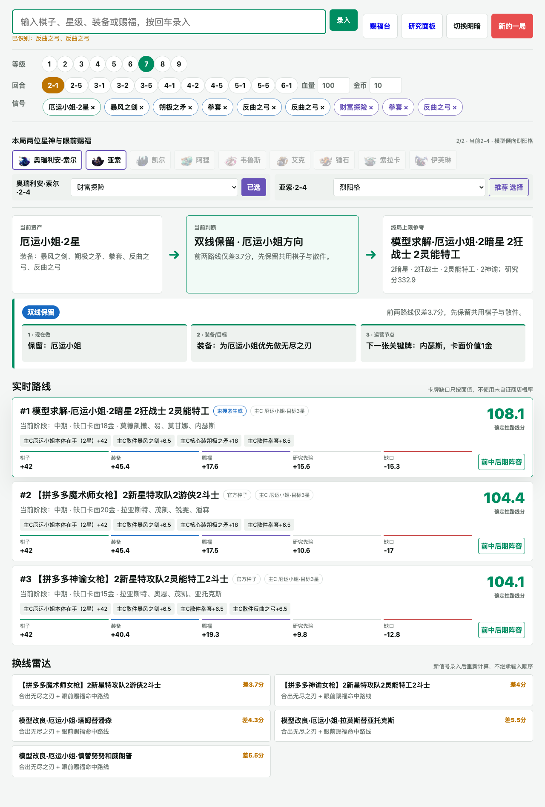

## Match Mode / 比赛模式

比赛模式面向快速连续录入，而不是要求每次填写一张完整局面表。棋子、星级、装备、羁绊和符文可直接用自然中文输入；当前等级、强化回合、对局回合和金币档位也可通过页面快捷按钮维护。

```text
来了个安妮还有波比，拿了羊刀
现在3-2，有35金币
来了高端，来了光明神器，来了升级吧，选哪个
```

当前版本的关键行为：

- 中文输入只在按回车或点击“录入”后提交，输入法组合阶段不会提前入池。
- “结束本局”保存或放弃复盘并开新局时，会取消仍在处理的 LLM 请求并清空本局状态，避免异步串局。
- 纠错支持“不是安妮是波比”“把羊刀改成轻语”“撤销上一个”等表达。
- 路线排名考虑已持有资产、星级、装备继承、商店概率、抗脆弱性和转阵成本；小分差不会频繁切换执行路线。
- 当前回合使用 `2-1 / 3-2 / 4-2` 快捷选择；金币只需选择 `0-9` 到 `50+` 的档位，不要求精确维护当前经验。
- 符文三选一在点击前只是候选，不会提前写入正式信号池。
- 棋子、装备、回合、经济和执行路线变化会形成比赛模式回放快照；“结束本局”补录名次、执行程度与明确判断后，才进入复盘样本。
- 复盘以30局可用样本作为探索校准门槛、100局作为划分独立留出集门槛；合成回归不计数，名次不会自动解释为模型对错。

### 符文三选一的可信边界

三选一页面不会再把阵容总分、静态虚拟胜率或路线覆盖数冒充为符文评分。系统只在局面信息和专属反事实模型均充分、且领先差超过阈值时才允许标记最佳项。当前专属反事实模型尚未完成，因此页面会：

- 展示已核验的符文机制和适用条件；
- 明确提示仍缺少的金币、回合、棋盘或装备信息；
- 将“命中多少条路线偏好”标为覆盖统计，不参与排序；
- 信息不足或证据未经验证时不默认标绿第一张，也不强行给出首推。

机制取值、来源等级、已确认项和未知项见 [怪兽入侵机制知识审计](文档/研究报告/怪兽入侵机制知识审计.md)。规则集快照位于 [`资源/游戏数据/ruleset/monster-invasion-17.7.json`](资源/游戏数据/ruleset/monster-invasion-17.7.json)，本次更新的数值差分与重算结论见 [17.7 版本更新重算](文档/研究报告/17.7版本更新重算.md)。

## Research Figures / 研究图谱

These figures are generated from the repository's deterministic outputs rather than drawn as presentation-only mockups. Run `npm run figures` after rebuilding the model to refresh every number shown below.

### Formula calculations / 公式计算

<p align="center">
  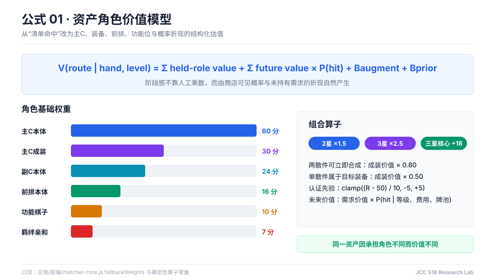
  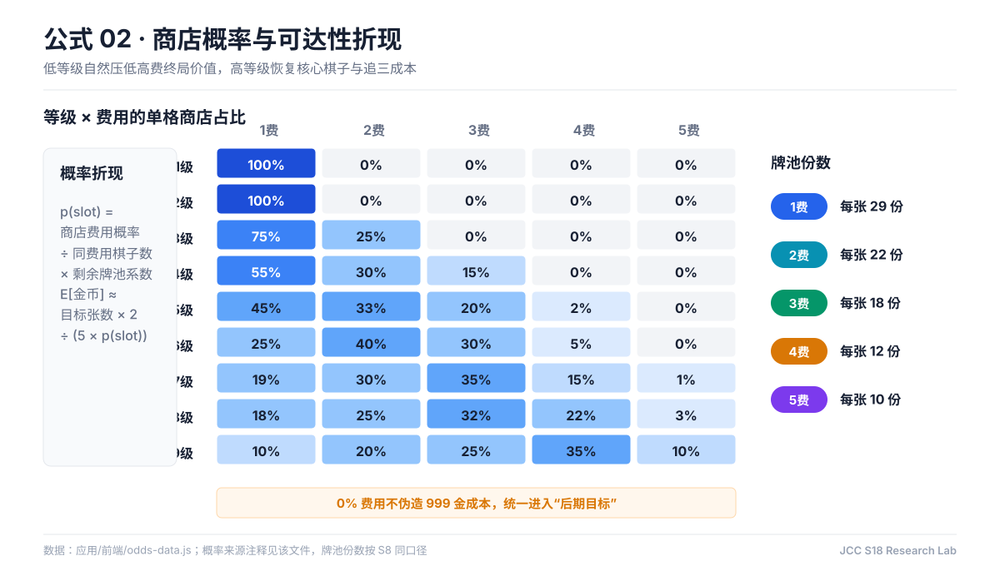
</p>

The first graph exposes the role coefficients used by Match Mode. The second graph maps the complete level 1-9 shop matrix and explains how an unavailable high-cost unit becomes a zero-value late target instead of a fake `999`-gold estimate.

<p align="center">
  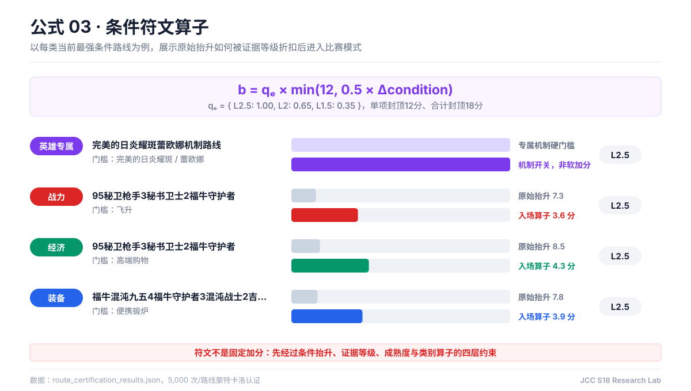
</p>

The augment graph separates hard hero-mechanism gates from soft combat, economy, and item operators. Soft bonuses must survive both the condition-lift cap and the evidence-level discount before entering a recommendation.

### Lineup derivation / 阵容推导

<p align="center">
  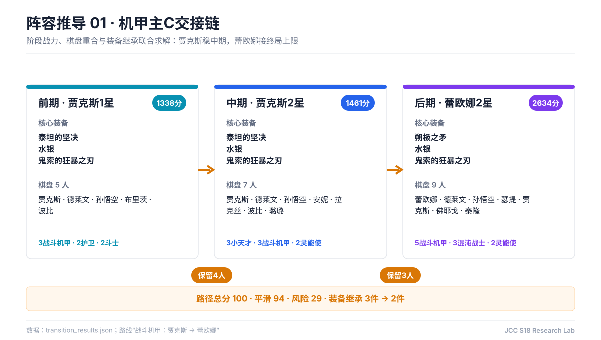
  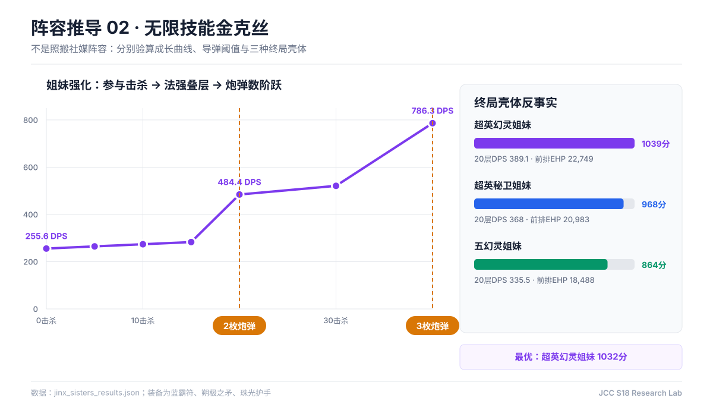
</p>

- **Mecha transition:** jointly optimizes stage strength, retained units, and item inheritance instead of scoring only the final board.
- **Jinx sisters:** independently validates the AP stacking curve, missile breakpoints, and three candidate end-board shells.

<p align="center">
  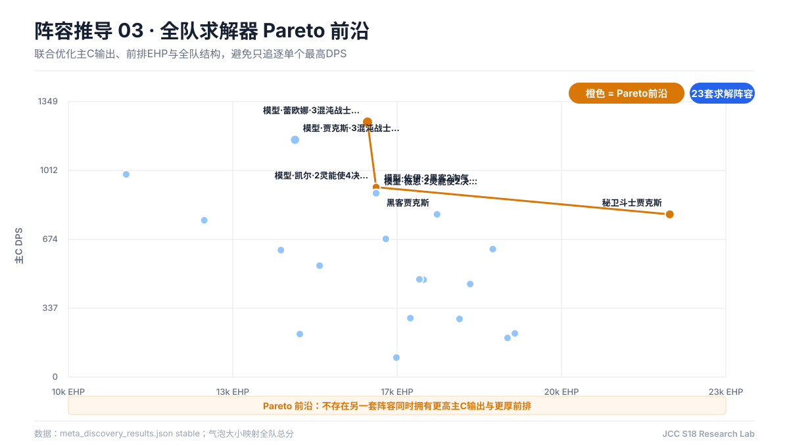
</p>

The solver frontier shows why the highest carry DPS is not automatically the best lineup. Orange points are non-dominated boards for carry output and frontline EHP; bubble size adds full-team value.

### Model verification / 模型验算

<p align="center">
  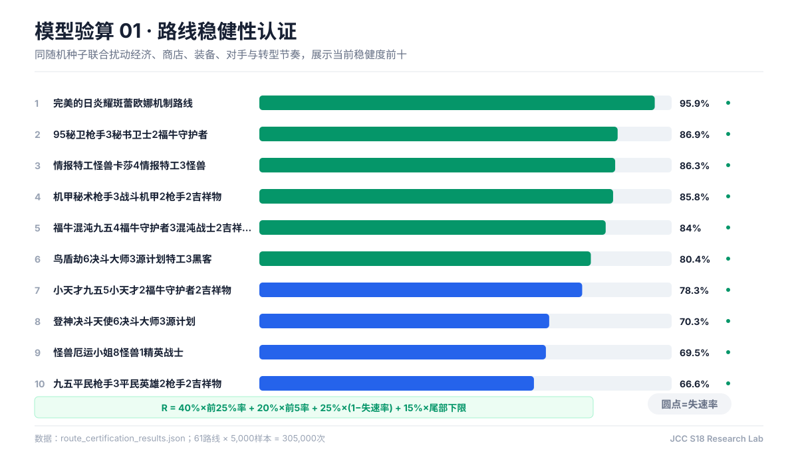
  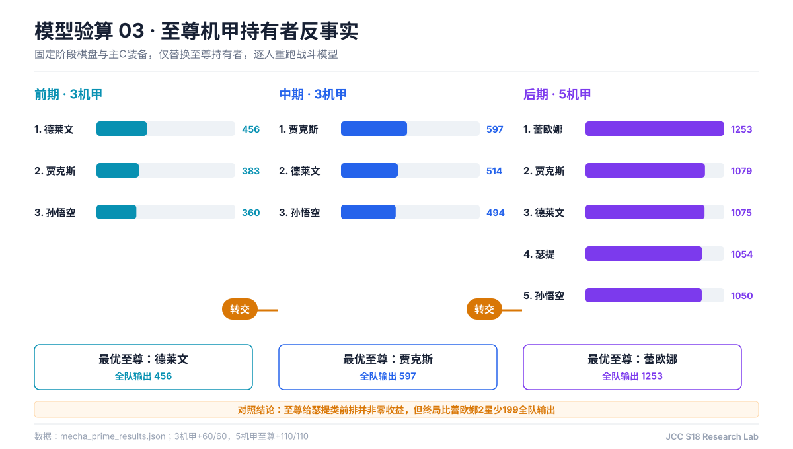
</p>

The certification chart summarizes the current top ten under shared uncertainty samples. The Prime experiment fixes the board and items, changes only the Prime holder, and reruns the combat model to isolate causal impact.

<p align="center">
  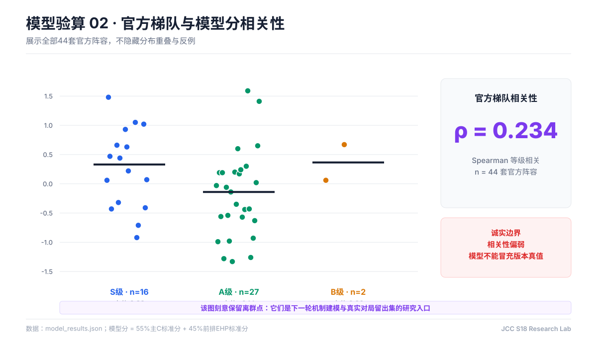
</p>

The validation boundary is intentionally visible: the current official-tier correlation is only `Spearman ρ = 0.234` across 45 lineups. The system therefore reports model evidence, not a claim that its ranking is already ground truth.

## Model Highlights

### Asset-role value model

Each held signal is valued by its role in a route rather than by flat checklist overlap:

```text
route score = held role value + probability-discounted future value
            + augment operators + bounded virtual-battle prior
```

- Main carry body and star level receive the highest unit value.
- Completed items are valued by holder role; components are paired without double counting.
- Missing units are discounted by level-specific shop odds and expected reroll gold.
- Explicit trait counts are matched against activated end-board traits.
- A fragile route can be downgraded when one low-probability component dominates the plan.

### Conditional augment operators

The condition lift is discounted by evidence level before entering Match Mode:

```text
b = q_e × min(12, 0.5 × (conditional fitness - baseline robustness))
q_e = { L2.5: 1.00, L2: 0.65, L1.5: 0.35 }
```

- **Combat augments** scale with current board readiness.
- **Economy augments** alter effective shop level, reroll cost, or copy requirements.
- **Item augments** compensate missing carry items and decay after the build is complete.
- **Hero augments** remain hard mechanism gates with explicit required units.

### Digital-twin boundary

The event engine currently evaluates all **67 routes in 2,211 pairings and 26,532 side-swapped battles**. Every pairing reuses the same random seed after swapping sides, then reports win rate, health margin, lower-tail CVaR, and mechanism coverage. Unsupported mechanics shrink the Match Mode prior toward zero instead of being silently treated as verified. The executable hero-augment catalog currently covers **53 of 122** entries; the remaining mechanics stay discounted instead of receiving guessed values.

The result is a **model-internal dominance claim**, not an observed ladder win rate. Public guides may seed candidate generation, but they do not calibrate ranking weights. The fast Match Mode model receives at most a bounded `±12` point prior from the event simulator:

```text
virtual prior = 12 × tanh((robust score - 50) / 18) × mechanism coverage
```

## 快速开始

### 1. 本机一键启动

macOS 直接双击项目根目录的 [`启动前端.command`](启动前端.command)。启动器会自动识别当前项目目录，启动本地服务并打开研究主界面。

### 2. Clone and test

```bash
git clone https://github.com/2300969-star/jcc-s18-research-lab.git
cd jcc-s18-research-lab
npm test
```

No runtime package installation is required. The project uses Node.js built-ins and a static frontend.

### 3. Start the dashboard manually

```bash
npm run serve
```

Open:

- Dashboard: `http://127.0.0.1:8766/应用/前端/index.html`
- Match Mode: `http://127.0.0.1:8766/应用/前端/match.html`
- Star God Match: `http://127.0.0.1:8766/应用/前端/star-god-match.html`
- Audit View: `http://127.0.0.1:8766/应用/前端/audit/index.html`

### 4. Optional LLM fallback

```bash
npm run proxy
```

In Match Mode settings, use `http://127.0.0.1:8787/v1` and provide your own OpenAI-compatible API key. The key remains in browser `localStorage`; the proxy forwards it without persisting it.

The local vocabulary parser always runs first. Without a key or network, the entire ranking system remains usable.

## Reproduce The Research

```bash
npm run build:model        # combat model, item search, full-team search
npm run build:discovery    # lineup discovery, transitions, numeric lens
npm run build:experiments  # Jinx sisters and Mecha experiments
npm run build:matcher      # stage matcher and route certification
npm run build:virtual      # 26,532 paired full-team event battles
npm run build:event-model  # coverage delta, operator audit, and route evidence
npm run research:community # audit public guides/videos as evidence, not ground truth
npm run audit              # data, skill, item, and outlier audits
npm run figures            # regenerate README research figures
```

Run the complete deterministic pipeline:

```bash
npm run build
```

Refresh upstream game data and regenerate all outputs:

```bash
npm run update:data
```

## 项目目录结构

```text
.
├── 启动前端.command          # macOS 一键启动入口
├── 应用/
│   └── 前端/                 # 静态主界面、比赛模式、浏览器数据和素材
├── 工程/
│   ├── 源码/
│   │   ├── core/             # 核心模型与版本上下文
│   │   ├── sim/              # 事件驱动战斗模拟
│   │   ├── pipeline/         # 搜索、转型、匹配和认证流程
│   │   ├── experiments/      # 专项反事实实验
│   │   ├── audit/            # 数值与数据质量审计
│   │   └── lib/              # 统一项目路径
│   ├── 测试/
│   │   └── 样本/             # 永久回归局面
│   ├── 工具/                 # 本地代理和图表生成器
│   └── 脚本/                 # 数据更新与维护入口
├── 资源/
│   └── 游戏数据/             # 腾讯游戏资料与版本化规则快照
├── 文档/
│   ├── 研究报告/             # 生成与人工维护的研究结论
│   ├── 阵容资料/             # 官方阵容明细
│   └── 图片/                 # README 图表和界面截图
└── 生成产物/
    ├── 结果/                 # 确定性 JSON 计算结果
    └── 截图/                 # 浏览器验收截图
```

详细职责、修改边界和常用入口见 [项目结构说明](文档/项目结构说明.md)。源码内部保留 `core/pipeline/experiments` 等通用模块名，便于 Node.js、CI 和公开仓库工具识别。

## Selected Reports

- [版本路线认证实验](文档/研究报告/版本路线认证实验.md)
- [虚拟实战数字孪生](文档/研究报告/虚拟实战数字孪生.md)
- [社区公开样本证据审计](文档/研究报告/社区公开样本证据审计.md)
- [元阵容自动求解](文档/研究报告/元阵容自动求解.md)
- [阵容发现研究](文档/研究报告/阵容发现研究.md)
- [姐妹无限金克丝实验](文档/研究报告/姐妹无限金克丝实验.md)
- [机甲分叉实验](文档/研究报告/机甲分叉实验.md)
- [至尊机甲实验](文档/研究报告/至尊机甲实验.md)
- [数值与 Bug 审计](文档/研究报告/数值与Bug审计.md)
- [17.7 版本更新重算](文档/研究报告/17.7版本更新重算.md)

## Regression Philosophy

When a real game disproves a recommendation, the preferred response is not an isolated score patch. Add the hand to [`工程/测试/样本/hands.json`](工程/测试/样本/hands.json), identify which assumption failed, and make the deterministic model pass both the new fixture and the existing suite.

## Scope And Disclaimer

This repository is independent, non-commercial community research. It is not an official product and does not guarantee placement or win rate. Game data, names, trademarks, icons, and artwork belong to their respective owners and are not covered by the MIT code license. See [NOTICE.md](NOTICE.md).

## Contributing

Issues and pull requests are welcome when they include reproducible evidence. Read [CONTRIBUTING.md](CONTRIBUTING.md), [SECURITY.md](SECURITY.md), and the [Code of Conduct](CODE_OF_CONDUCT.md) before contributing.
